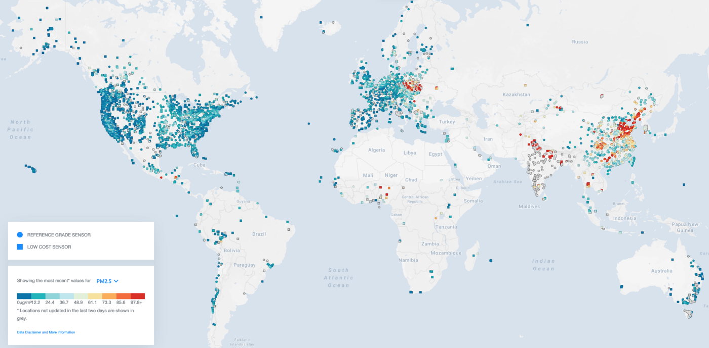

---
#esowc
#deep_learning
---

# Challenge #21 - Machine Learning to improve the CAMS global air quality forecasts

CAMS runs a global climate model (GCM) to predict global air pollution at resolution of 40km x 40km. Due to the scale of the GCM and uncertainties in inputs, there are errors when trying to accurately predict air quality on regional scales. Hence, bias-correction methods could be used as a post-processing step to minimize bias.

Simple bias-correcting methods assume that the bias is constant across time. Additionally, due to the spatially sparse air quality observations, it is hard to leverage spatial structure when deploying bias-correction methods. This problem is further complicated when considering a global model.

A (conceptually simpler) one-dimensional approach would be to train the model to perform better at the station location, by penalizing it's error at the locations. However, this approach is limited due to the sparsity of observations, and would fail to encapsulate the global nature of the CAMS model.

*Figure above shows a map of station locations on openAQ* 

## Proposal - Bias-correction  using a Recurrent U-Net 2-stage transfer learning approach

We propose a 2-stage transfer learning approach using a Recurrent U-Net Deep Learning model, which will be able to capture the variability of the CAMS model and the bias. We would conduct the study on a specific region (USA) which would serve as a proof of concept, due to the availability of stationary reference-grade data on openAQ (all PM2.5, O3 and NO2). The model could be used for any of the three species. 

A two-stage approach allows us to work with the sparse observations and the global  model. The first stage model would be a black-box version of CAMS. Then we can use a second stage to train the model at the station locations. The bias-correction would be the difference between these two stages. This would provide better insight of CAMS's performance in specific regions.

 We would be able to leverage past knowledge with previous studies conducted on this region (see link below). This model would then be able to be trained on different regions including Europe and China. The lower-quality data would require more rigorous treatment and an extended study before inclusion and thus we propose to not include it at first.

[Previous work of colleague on Github by Tailong He at University of Toronto](https://github.com/tailonghe/DLO3)

The Recurrent U-Net model has already proved useful in predicting summertime MDA8 surface ozone concentrations in the US, using meteorological fields from the ERA-interim reanalysis and monthly mean NOx emissions from the Community Emissions Data System (CEDS) inventory as predictors.

Note that current DL model is similar but not yet adapted to the task. We would develop a modified version of this model which would be able to work  with the CAMS + openAQ dataset. We would include as the meteorological fields + NOx emissions from CAMS and predict O3 concentration to bias-correct.

&nbsp;

# Timeline
| Month | Deliverable |
| :--- | --- |
| May |  A cohesive dataset to be fed into a TensorFlow2 deep learning model |
| June | Trained TensorFlow2 model which is able to correct bias over USA |
| July | Model performance analysis. Further improved model performance. |
| August | Well documented Github repository | 

&nbsp;

# Breakdown

### May
Gather and preprocess openAQ + CAMs data, reducing data size. Probably the longest of the tasks. The goal is to create a single 4D tensor containing relevant data (or figure out how to efficiently read in data during training from local CAMS + openAQ dataset during training.  Use Xarray (and possibly Dask) to handle large amounts of data.

### June
 Modifying existing TensorFlow model architecture for stage one and second stage transfer learning. Train model on CAMS first, followed by training on openAQ. The first task should be simple, with the later being a bit more challenging. 

### July
Spatial and temporal analysis. When and where is the model performing well/not well? Why is this the case?Further improve model performance.

### August
 Make reproducible, open source friendly, documentation and extendable to other regions

### Questions
- Exactly what data are we using?
- What predictors? and output?
